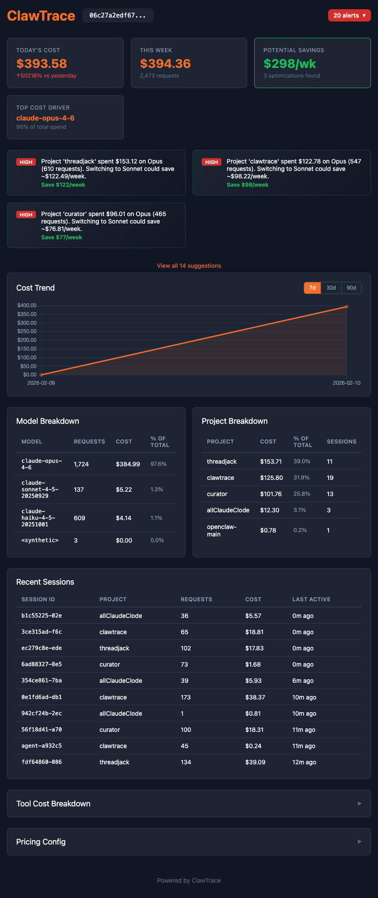

# ClawTrace

**Local-first cost analytics for OpenClaw and Claude Code agents.**

See what your AI agents are really costing you — per model, per project, per session. Your data stays on your machine. No cloud required.



## Why

OpenClaw's creator [explicitly rejected](https://x.com/steipete) built-in telemetry. Enterprise users still want cost visibility. ClawTrace fills the gap: full observability without compromising privacy.

- Reads session logs directly from `~/.openclaw/agents` and `~/.claude/projects`
- Parses both OpenClaw and Claude Code JSONL formats
- Computes costs using up-to-date model pricing
- Sends nothing anywhere unless you opt in

## Quick Start

```bash
pip install git+https://github.com/superlowburn/clawtrace.git
clawtrace serve
```

Open `http://localhost:19898` — that's it.

## What You Get

- **Cost tracking** — daily spend, running totals, per-session breakdowns
- **Model breakdowns** — see exactly which models are burning your budget
- **Project costs** — track spend across repos and workspaces
- **Anomaly detection** — automatic alerts when costs spike above rolling averages
- **Alerts** — daily budget ($10), session spike ($5), hourly burn rate ($3), configurable thresholds
- **Dual-format parsing** — handles both Claude Code and OpenClaw session logs natively

## CLI

```
clawtrace status          # Today's cost, tokens, sessions
clawtrace cost-report     # 7-day breakdown by model, project, session
clawtrace cost-report --days 30
clawtrace anomalies       # Cost spikes
clawtrace serve           # Start dashboard on localhost:19898
clawtrace serve --port 8080
```

All commands support `--json` for scripting.

## Hosted Sync (Optional)

Want dashboards across devices? Opt in to hosted sync — only timestamps, model names, token counts, and costs are sent. Never conversation content.

```bash
curl -sL clawtrace.vybng.co/install | bash
```

This registers your device and sets up automatic sync. View your hosted dashboard at [clawtrace.vybng.co](https://clawtrace.vybng.co).

**Early access: all users get Pro-level features for free.**

| Tier | Price | Projects | Retention | Devices |
|------|-------|----------|-----------|---------|
| Free | $0 | 1 | 7 days | 1 |
| Pro | $79 (one-time) | Unlimited | 90 days | 1 |
| Team | $199 (one-time) | Unlimited | 90 days | 3 |

## Architecture

```
~/.openclaw/agents/*.jsonl ──┐
                              ├──► engine (parser → aggregator → anomaly) ──► localhost:19898
~/.claude/projects/*.jsonl ──┘                                                     │
                                                                                   │ opt-in
                                                                              sender.py
                                                                                   │
                                                                          clawtrace.vybng.co
```

The engine is a Python package with a Flask API. Everything runs locally. The optional sender syncs anonymized usage data to the hosted backend for multi-device dashboards and longer retention.

## Configuration

Config lives at `engine/config.json`:

```json
{
  "data_paths": ["~/.openclaw/agents", "~/.claude/projects"],
  "server_port": 19898,
  "anomaly_threshold": 0.25,
  "alerts": {
    "daily_budget_usd": 10.00,
    "session_spike_usd": 5.00,
    "hourly_burn_rate_usd": 3.00
  }
}
```

## Supported Models

Claude (Opus, Sonnet, Haiku), Kimi K2.5, GLM-4.7, MiniMax M2.1, and any model with token usage in session logs. Unknown models get flagged with zero-cost pricing so nothing is silently dropped.

## Development

```bash
git clone https://github.com/superlowburn/clawtrace.git
cd clawtrace
pip install -e .
python -m pytest engine/tests/ -v    # 171 tests
python -m pytest skill/test_sender.py -v  # 32 tests
```

Requires Python 3.11+.

## License

MIT

## Links

- [Landing page](https://clawtrace.vybng.co)
- [GitHub](https://github.com/superlowburn/clawtrace)

Built by [@comforteagle](https://x.com/comforteagle)
